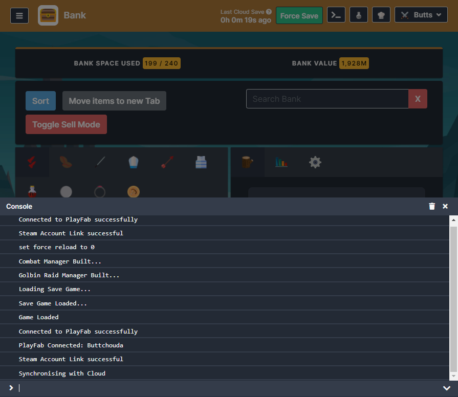

# M3 JS Console for Melvor Idle
Allows you to use an emulation of the developer console in the Steam edition of Melvor Idle. Shift + ` to access (configurable via the [Keybindings](https://github.com/ChaseStrackbein/melvor-keybindings) mod). There is also a button to open the console once loaded into a character, found next to the cloud save button.

